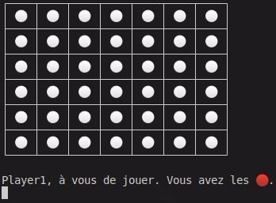

    __________      .__                                               _____ 
    \______   \__ __|__| ______ ___________    ____   ____  ____     /  |  |
     |     ___/  |  \  |/  ___//  ___/\__  \  /    \_/ ___\/ __ \   /   |  |_
     |    |   |  |  /  |\___ \ \___ \  / __ \|   |  \  \__\  ___/  /    ^   /
     |____|   |____/|__/____  >____  >(____  /___|  /\___  >___  > \____   |
                            \/     \/      \/     \/     \/    \/       |__|

## The game
Each player starts by choosing a dot color among these : 🔴 🟠 🟡 🟢 🔵 🟣 🟤 ⚫  
Then, you can play by typing the index of the column that you want. The columns are numbered from 0 (left) to 6 (right).

By typing 'q', you can also leave the game.

## Continue a game from a file

If you left the previous game before the end and would like to resume it, you can select the appropriate option when the program is launched. The game will then resume where you left off.

A more detailed report is available in `report/report.pdf`.

## Usage

To start the program, simply type : `java Connect4.Main`.